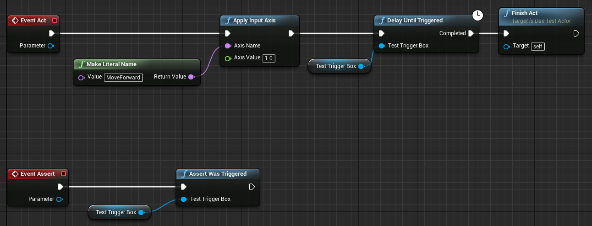
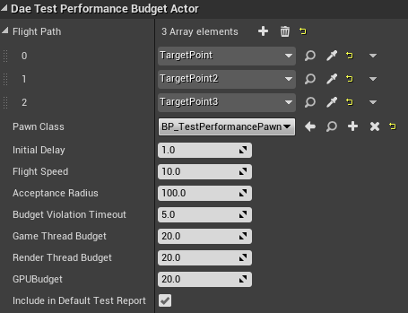
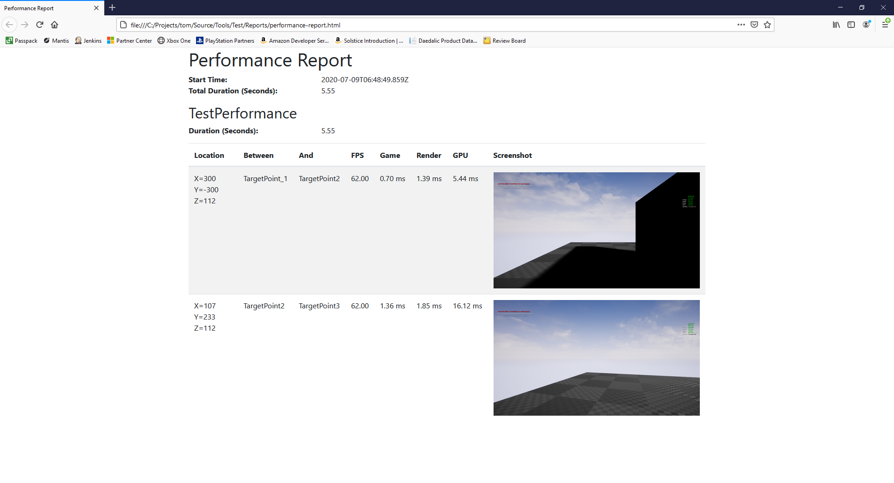
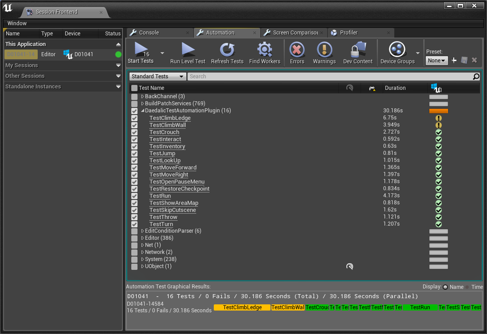
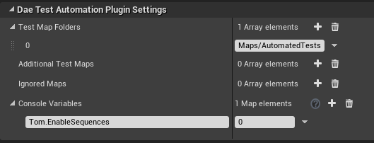

# Automated Blueprint Tests

[](https://github.com/janousch/Automated-Blueprint-Tests/blob/main/LICENSE)

The _Automated Blueprint Tests Plugin_ facilitates creating and running unit tests, integration tests and performance tests with the [Gauntlet Automation Framework](https://docs.unrealengine.com/en-US/Programming/Automation/Gauntlet/index.html) of [Unreal Engine](https://www.unrealengine.com).

Automated testing, when applied instead of or in addition to manual testing, provides multiple benefits:

* _Clean code._ Automating tests requires the tested code to be very modular, which improves maintainability in general.
* _Fast results._ Running automated tests is usually a lot faster than testing manually, and can be performed unattended.
* _Better coverage._ As a result, we can test more parts of our game when using automated testing than without, allowing manual testers to focus on other parts of the game.
* _Increased stability_. Being able to run automated tests greatly increases the confidence of the development team when applying bigger changes to the code base, allowing them to catch regressions early (e.g. after optimizing performance).

We feel like software testing is far too important not to be supported by automation, and test automation still hasn't fully found its way into game development. We believe that this is party because creating automated tests for games tends to be tedious, and we want to improve on that.


## Contents

1. [Setup](#setup)
    1. [Prerequisites](#prerequisites)
    1. [Adding The Plugin](#adding-the-plugin)
1. [Creating Tests](#creating-tests)
    1. [Assertions](#assertions)
    1. [Delays](#delays)
    1. [Simulating Input](#simulating-input)
    1. [Test Trigger Boxes](#test-trigger-boxes)
    1. [Test Timeouts](#test-timeouts)
    1. [Test Suite Lifecycle](#test-suite-lifecycle)
    1. [Parameterized Tests](#parameterized-tests)
    1. [Skipping Tests](#skipping-tests)
    1. [Assumptions](#assumptions)
    1. [Performance Tests](#performance-tests)
1. [Running Tests](#running-tests)
    1. [Play In Editor](#play-in-editor)
    1. [Automation Window](#automation-window)
    1. [Gauntlet](#gauntlet)
1. [Configuring Tests](#configuring-tests)
    1. [Console Variables](#console-variables)
1. [Reporting Results](#reporting-results)
    1. [JUnit Test Reports](#junit-test-reports)
    1. [Custom Test Reports](#custom-test-reports)
1. [Best Practices](#best-practices)
1. [Bugs, Questions & Feature Requests](#bugs-questions--feature-requests)
1. [Development Cycle](#development-cycle)
1. [Contributing](#contributing)
1. [Future Work](#future-work)
1. [License](#license)
1. [References](#references)


## Setup

### Prerequisites

Daedalic Test Automation Plugin currently supports the following Unreal Engine Versions:

* 4.27
* 5.0
* 5.1
* 5.2
* 5.3

Note that you currently have to compile the plugin yourself, and thus need a C++ Unreal project.

If you want to use [Gauntlet](#gauntlet) for running your tests, you'll need a source version of Unreal Engine as well.

### Adding The Plugin

1. [Clone](https://github.com/janousch/Automated-Blueprint-Tests) the repository or [download](https://github.com/janousch/Automated-Blueprint-Tests/releases) a release.
1. Close the Unreal Editor.
1. Copy the `AutomatedBlueprintTests` folder to the `Plugins` folder next to your `.uproject` file.
1. Copy the `AutomatedBlueprintTests.Automation` folder to the `Build/Scripts` folder next to your ```.uproject``` file.
1. Start the Unreal Editor.
1. Enable the plugin in Edit > Plugins > Automated Blueprint Tests.
1. Close the Unreal Editor.
1. Right-click your `.uproject` file and select _Generate Visual Studio project files_.
1. Build the resulting solution in Visual Studio.
1. Start the Unreal Editor.

## Creating Tests

The Automated Blueprint Tests Plugin is fully exposed to blueprints in order to allow everyone to easily create tests. Each level represents a _test suite_, which in turn can consist of multiple _tests_.

You'll be using Gauntlet to run one or more test suites, or the Unreal Editor to run a single test suite.


In order to create a new test suite with a single test:

1. Create a new level.
1. Add a _Test Suite Actor_ to the level.
1. Create a _Test Actor_ blueprint (e.g. through right-click in Content Browser > Create Advanced Asset > Test Automation > Test Actor Blueprint).
1. Implement the Arrange, Act and Assert events of the test actor (see below).
1. Add an instance of the test actor blueprint to the level.
1. Add the test actor reference to the list of tests of the test suite actor.

Automated tests in the Automated Blueprint Tests Plugin are built with the Arrange-Act-Assert pattern in mind:

* In _Arrange_, you should set up your test environment, get references to required actors and components, and prepare everything for the actual test.
* In _Act_, you should perform the actual action to test. Here, you're allowed to use latent actions, such as delays, to test what you want to test. Because we don't know when you're finished, you have to call _Finish Act_ when you're done.
* In _Assert_, you should use the built-in assertion framework to verify the results of your tests, e.g. check the state of variables or positions of actors.

If any of the assertions performed in the Assert step fail, the test will be marked as failed.


You can verify your test suite by entering PIE and filtering your log by the `LogAbtTest` log category.

```
LogAbtTest: Display: AAbtTestSuiteActor::RunAllTests - Test Suite: AbtTestSuiteActor_1
LogAbtTest: Display: AAbtTestSuiteActor::RunNextTest - Test: BP_TestCalculatorAddsNumbers_2
LogAbtTest: Display: AAbtTestSuiteActor::OnTestSuccessful - Test: BP_TestCalculatorAddsNumbers_2
LogAbtTest: Display: AAbtTestSuiteActor::RunNextTest - All tests finished.
```

You'll also find a handful of example tests in the Content folder of the plugin.

### Assertions

There's a whole lot of _assertion_ nodes for use in your automated tests, including equality and range checks for all basic blueprint types, or verifying the state of UMG widgets. Take a look at [Documentation/Assertions.md](Documentation/Assertions.md) for more details.

### Delays

Automated Blueprint Tests Plugin comes with additional _delay_ nodes that you might find useful when building your tests. Take a look at [Documentation/Delays.md](Documentation/Delays.md) for more details.

### Simulating Input

We provide blueprint nodes for simulating _player input_, both actions and axes. Actions will be applied once immediately, while axes will be applied until explicitly reset by applying it again. You can use all actions and axes defined in your input mappings (Edit > Project Settings > Engine > Input).

Simulated input is especially helpful when combined with [Delays](#delays):



### Test Trigger Boxes

Automated Blueprint Tests Plugin ships with a convenience _Test Trigger Box_ that allows you to set up test delays and assertions more quickly. These trigger boxes will just set a flag when triggered, and write a log. Our built-in [delays](Documentation/Delays.md) and [assertions](Documentation/Assertions.md) will use that flag to check if the box has been triggered.

### Test Timeouts

At your _Gauntlet Test Actor_ blueprint (or instance), you can specify a _timeout_ for the test (defaults to 30 seconds).


If your test times out during the Act stage, we'll execute all assertions immediately instead of waiting for the Act stage to finish. This allows your test to finish with just warnings instead of errors, in case you just set up some wrong delays, for instance. However, if your assertions actually fail after the timeout, the test will be marked as failed as usual.

```
LogAbtTest: Display: AAbtTestSuiteActor::RunAllTests - Test Suite: AbtTestSuiteActor_1
LogAbtTest: Display: AAbtTestSuiteActor::RunNextTest - Test: BP_TestMoveForward_2
LogAbtTest: Warning: Timed out after 5.000000 seconds
LogAbtTest: Error: Assertion failed - Trigger box AbtTestTriggerBox_1 wasn't triggered
LogAbtTest: Error: AAbtTestSuiteActor::OnTestFailed - Test: BP_TestMoveForward_2, FailureMessage: Assertion failed - Trigger box AbtTestTriggerBox_1 wasn't triggered
LogAbtTest: Display: AAbtTestSuiteActor::RunNextTest - All tests finished.
```

### Test Suite Lifecycle

Instead of just adding a default _Test Suite Actor_ to your level, you can create a test suite blueprint instead (e.g. through right-click in Content Browser > Create Advanced Asset > Test Automation > Test Suite Actor Blueprint).

Test suite blueprints allow you to implement the following _lifecycle events_:

* `BeforeAll`: Executed before running the first test.
* `BeforeEach`: Executed every time before running a test.
* `AfterEach`: Executed every time after running a test.
* `AfterAll`: Executed after running the last test.

After creating your test suite blueprint, you can add instances of that blueprint to your test levels just as you would with the default test suite actor. Then, add test actor references to the list of tests of your test suite as usual.

### Parameterized Tests

In case you want to run the same test multiple times with just slightly different configurations, Automated Blueprint Tests Plugin offers _parameterized tests_. You can specify any number of parameters for your test instance (or blueprint).

In order to provide a consistent test API, these parameters have to be of type UObject, so if you have any other type you want to pass in as parameter, you'll need to wrap them with an UObject. Using UObject parameters also enables you to reference other actors in your test level. We're using soft references to the parameter objects, enabling you to reference actors from other streaming levels as well.


The parameter references will be resolved and passed to all test events, where you can perform your test actions on them:


The test will be run once for each parameter, and each test run will be treated exactly as if you'd run a non-parameterized test:

* the test time is reset for each parameter
* BeforeEach and AfterEach are called for each parameter
* test reports include one test per parameter

```
LogAbtTest: Display: AAbtTestSuiteActor::RunAllTests - Test Suite: AbtTestSuiteActor_1
LogAbtTest: Display: AAbtTestSuiteActor::RunNextTest - Test: BP_TestParameterized_TwoParameters - BP_TestParameter1
LogBlueprintUserMessages: [BP_TestParameterized_TwoParameters] BP_TestParameter1
LogAbtTest: Display: AAbtTestSuiteActor::OnTestSuccessful - Test: BP_TestParameterized_TwoParameters - BP_TestParameter1
LogAbtTest: Display: AAbtTestSuiteActor::RunNextTest - Test: BP_TestParameterized_TwoParameters - BP_TestParameter2
LogBlueprintUserMessages: [BP_TestParameterized_TwoParameters] BP_TestParameter2
LogAbtTest: Display: AAbtTestSuiteActor::OnTestSuccessful - Test: BP_TestParameterized_TwoParameters - BP_TestParameter2
LogAbtTest: Display: AAbtTestSuiteActor::RunNextTest - All tests finished.
```

Sometimes, you'll want to provide the test parameters dynamically, e.g. when you need to convert them to UObjects. Automated Blueprint Tests Plugin features _Test Parameter Provider Actors_ for this: You can create parameter provider blueprints (e.g. through right-click in Content Browser > Create Advanced Asset > Test Automation > Test Parameter Provider Actor Blueprint). Then, you can override the `GetParameters` function to provide parameters for your test.


Finally, you'll have to add your provider to your test level, and to your test:


For each parameterized test, all parameter providers are applied exactly once, before the first run of that test.

### Skipping Tests

If you want to temporarily _disable_ a test, you may specify a Skip Reason at your 
_Test Actor_ blueprint (or instance). Setting the Skip Reason to a non-empty string will cause the test to be skipped with the specified message. We don't provide a way of skipping a test without specifying a reason, because we feel that people should always know why a test is currently disabled.


Skipped tests will be marked as neither successful nor failed, and will show up explicitly as skipped in test reports.

```
LogAbtTest: Display: AAbtTestSuiteActor::RunAllTests - Test Suite: AbtTestSuiteActor_1
LogAbtTest: Display: AAbtTestSuiteActor::RunNextTest - Test: BP_TestClimbLedge
LogAbtTest: Display: AAbtTestSuiteActor::OnTestSkipped - Test: BP_TestClimbLedge, SkipReason: Does not seem to succeed reliably. Occasionally, we fail to get a hold of the ledge after jumping if done automatically by the test.
LogAbtTest: Display: AAbtTestSuiteActor::RunNextTest - All tests finished.
```

### Assumptions

You can also specify dynamic conditions for skipping a test through _assumptions_. This extends the above test model from Arrange-Act-Assert to Assume-Arrange-Act-Assert: You can make an arbitrary number of assumptions before even arranging up your test (e.g. check the value of some configuration variable or command-line parameter, or check the current runtime platform).


If any of your assumptions fail, the test will be skipped instead of being marked as failure:

```
LogAbtTest: Display: AAbtTestSuiteActor::RunAllTests - Test Suite: AbtTestSuiteActor_1
LogAbtTest: Display: AAbtTestSuiteActor::RunNextTest - Test: BP_TestAssume_2
LogAbtTest: Display: AAbtTestSuiteActor::OnTestSkipped - Test: BP_TestAssume_2, SkipReason: Assumption failed - Running on XboxOne - Expected: True, but was: False
LogAbtTest: Display: AAbtTestSuiteActor::RunNextTest - All tests finished.
```

### Performance Tests

Automated Blueprint Tests Plugin provides built-in performance testing. You can add an instance of an `AAbtTestPerformanceBudgetActor` to any of your test suites (even without the need to create a blueprint for that test). For that actor, you'll need to specify at least two parameters:

First, place a few _target points_ in your level, and add them to the _Flight Path_ of your performance budget actor. Second, specify the _Pawn Class_ to follow that flight path (e.g. a default pawn with camera and without collision).



When running your test, your pawn will be spawned and possessed. After an initial delay, that pawn will follow your specified flight path, keeping track of your game performance. Whenever any of your performance budgets is violated, it will write a screenshot and store data about the violation, including the location where the violation occurred and the actual performance at that location. Then, it will ignore any further violations for a few seconds to avoid excessive result sets.

From plugin perspective, the performance test will behave like any other test: It will finish as soon as your pawn reaches the last point in your flight path. Then, it will assert that no budget violations have occurred.

When running through Gauntlet, it will also use a [custom report writer](#custom-test-reports) to write a performance report to disk:



The performance report is based on HTML, and can be published by your CI/CD pipeline as well (e.g. using [HTML Publisher for Jenkins](https://plugins.jenkins.io/htmlpublisher/)).


## Running Tests

### Play In Editor

You can run each test suite by just entering _Play In Editor_, if "Run in PIE" is checked for that test suite (default).

### Automation Window

In order for the plugin to pick up your tests, specify your test map folders in Edit > Project Settings > Plugins > Automated Blueprint Tests.


Then, you can use the _Automation window_ of the session frontend of the Unreal Editor (Window > Test Automation) to run multiple tests. Your tests will be shown under the category AutomatedBlueprintTests:



### Gauntlet

In order to run multiple tests from command-line (e.g. as part of your CI/CD pipeline), we recommend using _Gauntlet_, which can be run by passing a specific set of parameters to the Unreal Automation Tool (UAT).


When using Gauntlet for running automated tests, as we don't want to force you to modify your version of Unreal Engine, we need to know where your source version of the engine can be found on disk.

Set the `UNREAL_ENGINE_4_PATH` environment variable to the root folder of your source checkout, e.g. the directory that contains files like `Setup.bat` or `GenerateProjectFiles.bat`. 

Note that you might need to restart your shells and/or Visual Studio in order to have your changes take effect.

If everything is set up correctly, `AutomatedBlueprintTests.Automation` will be discovered when generating your project files (because the engine finds it in your Build directory). The project will then use your environment variable to publish its build results to the `Engine\Binaries\DotNET\AutomationScripts` folder your engine, where they can be discovered by the Unreal Automation Tool for running Gauntlet.

Now, here's an example command line to get started:

```
"C:\Projects\UnrealEngine\Engine\Build\BatchFiles\RunUAT.bat"
RunUnreal
-project="C:\Projects\UnrealGame\UnrealGame.uproject"
-scriptdir="C:\Projects\UnrealGame"
-platform=Win64
-configuration=Development
-build=editor
-test="AutomatedBlueprintTests.Automation.AbtGauntletTest"
```

In the command line above:

* `RunUAT.bat` starts the Unreal Automation Tool (UAT).
* `RunUnreal` tells the UAT to run Gauntlet.
* `-project` specifies the full path to your Unreal project file.
* `-scriptdir` tells UAT to compile and load your UAT extensions (in this case, at least `AutomatedBlueprintTests.Automation`).
* `-build` tells Gauntlet to use your editor project instead of a packaged build.
* `-test` tells Gauntlet to use our custom controller (which in turn runs the test suites).

This will run all tests the plugin finds in your Test Map Path (see [Automation Window](#automation-window)). Gauntlet will tell you which tests have been run, along with their results. It will also tell you where to find the log files of the test runs (artifacts). You can specify `-verbose` as additional parameter to the UAT to get even more feedback.

Because documentation on Gauntlet is still sparse, you occasionally might want to check back on the original source files to learn about supported parameters and internal workings:

* `Gauntlet.UnrealBuildSource.ResolveBuildReference` will tell you more about valid options for the `-build` parameter (e.g. running a staged build)
* `EpicGame.EpicGameTestConfig` (and its base classes) is used by our `AutomatedBlueprintTests.Automation.AbtTestConfig` and can tell you more about valid options for the `-test` parameter.
* `Gauntlet.ArgumentWithParams.CreateFromString` is used for actually parsing the `-test` parameter.

You can also specify additional parameters along with the `test` parameter for the test run:

* `JUnitReportPath`: Generates a [JUnit XML report](#junit-test-reports) to publish with your CI/CD pipeline.
* `ReportPath`: Folder to write custom reports to.
* `TestName`: Runs the specified test, only, instead of all tests.

Example:

```
"C:\Projects\UnrealEngine\Engine\Build\BatchFiles\RunUAT.bat"
RunUnreal
-project="C:\Projects\UnrealGame\UnrealGame.uproject"
-scriptdir="C:\Projects\UnrealGame"
-platform=Win64
-configuration=Development
-build=editor
-test="DaedalicTestAutomationPlugin.Automation.DaeGauntletTest(JUnitReportPath=C:\Projects\UnrealGame\Saved\Reports\junit-report.xml,ReportPath=C:\Projects\UnrealGame\Saved\Reports)"
```


## Configuring Tests

### Console Variables

Sometimes, you'll want to use a special configuration for running your tests. For instance, for Gollum, we needed to disable playing the intro sequences of levels to test the performance of.

In Edit > Project Settings > Plugins > Daedalic Test Automation Plugin, you can specify console variables to be set before running batches of tests (e.g. through the automation window or Gauntlet). When using the automation window, the original values of these console variables will be stored before and restored after each test has run. For Gauntlet, this isn't necessary, as console variables have session scope.



Note that these console variables won't be applied when running tests directly in PIE.


## Reporting Results

### JUnit Test Reports

When running tests through Gauntlet, Daedalic Test Automation Plugin can generate test reports to publish with your CI/CD pipeline.

When generating _JUnit reports_ (by specifying the `JUnitReportPath` for [Gauntlet](#gauntlet)), the plugin uses a standardized format based on `org.junit.platform.reporting.legacy.xml.XmlReportWriter.writeTestsuite`, allowing you to publish the report just as you would when using JUnit. Here's an example of how the results look like when published with [Jenkins](https://www.jenkins.io/):


Test reports will be (over-)written after each individual test, to ensure to be able to publish at least partial results in case of a crash.

### Custom Test Reports

When building your own tests, you can also have the plugin write _custom reports_. This isn't exposed to blueprints, so you'll have to extend `ADaeTestActor` in C++. 

In addition to implementing `NotifyOnArrange`, `ReceiveOnAct_Implementation` and `NotifyOnAssert` as you like, you'll have to implement two methods for generating your custom reports:

First, `CollectResults` should return a shared pointer to custom test result data you want to publish in your reports. This data will be stored along with the default result data the plugin collects for all tests. Here's an example from our performance test implementation:

```
TSharedPtr<FDaeTestResultData> ADaeTestPerformanceBudgetActor::CollectResults() const
{
    TSharedPtr<FDaeTestPerformanceBudgetResultData> Results =
        MakeShareable(new FDaeTestPerformanceBudgetResultData());

    Results->BudgetViolations = BudgetViolations;

    return Results;
}
```

Your custom result data class needs to extend `FDaeTestResultData` and implement `GetDataType`. As test results are no `UObject`s, the plugin uses this method for allowing you to safely type-cast your result data in your custom report writers:

```
FName FDaeTestPerformanceBudgetResultData::GetDataType() const
{
    return TEXT("FDaeTestPerformanceBudgetResultData");
}
```

Second, `GetReportWriters` should return a set of report writers that are supposed to write reports for your test. The plugin will call that method for each individual test and merge the results, avoiding duplicate report writers. In the example of our performance testing, we're allowing the user to specify whether they want to include the test in the default JUnit report as well:

```
FDaeTestReportWriterSet ADaeTestPerformanceBudgetActor::GetReportWriters() const
{
    FDaeTestReportWriterSet ReportWriters;

    if (bIncludeInDefaultTestReport)
    {
        FDaeTestReportWriterSet DefaultReportWriters = Super::GetReportWriters();
        ReportWriters.Add(DefaultReportWriters);
    }

    ReportWriters.Add(MakeShareable(new FDaeTestReportWriterPerformance()));
    return ReportWriters;
}
```

Your own report writer needs to extend `FDaeTestReportWriter` and implement two methods again: `GetReportType` is used for comparing the types of report writers, as we aren't using `UObjects` here again. `WriteReport` is supposed to actually write your report data to disk. Basically, you're allowed to do anything you want here, but usually, this includes the following steps:

1. Use `IPlatformFile` to ensure that the path to write your reports to exists.
1. Iterate over all test suites and their respective results to collect your report data.
1. Use `FFileHelper` to write your results to disk.

Again, here's an example from our performance report writer for collecting report data:

```
for (const FDaeTestSuiteResult& TestSuiteResult : TestSuites)
{
    for (const FDaeTestResult& TestResult : TestSuiteResult.TestResults)
    {
        if (TestResult.Data != nullptr
            && TestResult.Data->GetDataType() == TEXT("FDaeTestPerformanceBudgetResultData"))
        {
            TSharedPtr<FDaeTestPerformanceBudgetResultData> Data =
                StaticCastSharedPtr<FDaeTestPerformanceBudgetResultData>(TestResult.Data);

            // ...
        }
    }
}
```


## Best Practices

There are a few best practices we learned when writing tests, and we want to share those with you. We also recommend taking a closer look at the [References](#References) below, which go into more detail.

1. _Keep your tests small._ Large tests that fail don't tell you much about the actual problem, especially when they contain multiple assertions. Try creating multiple small tests instead.
1. _Mock your dependencies._ Testing complex objects often forces you to violate the previous rule. Consider refactoring the code under test by splitting up your classes, and inject mock objects for dependencies where possible.
1. _Keep your tests fast._ Slow tests will eventually keep your team from running them. Even integration tests should never take much longer than a few seconds.
1. _Use meaningful test names._ Good test names can tell you much about the issue at a very first glance. Consider even using a common pattern for all tests, i.e. including the object and function under test, and the assertion you're making.
1. _Don't repeat yourself._ As with all software development, don't copy and paste your test logic. Use BeforeAll/BeforeEach/AfterEach/AfterAll and/or move test logic to function libraries where possible.


## Bugs, Questions & Feature Requests

Daedalic Test Automation Plugin is still under heavy development. Whenever you're experiencing issues, missing a feature, or you just don't understand a part of the plugin, after verifying that you are using the [latest version](https://github.com/DaedalicEntertainment/ue4-test-automation/releases) and having checked whether a [similar issue](https://github.com/DaedalicEntertainment/ue4-test-automation/issues) has already been reported, feel free to [open a new issue](https://github.com/DaedalicEntertainment/ue4-test-automation/issues/new). In order to help us resolving your problem as fast as possible, please include the following details in your report:

* Steps to reproduce
* What happened?
* What did you expect to happen?

After being able to reproduce the issue, we'll look into fixing it immediately.


## Development Cycle

We know that using this plugin in production requires you to be completely sure about stability and compatibility. Thus, new releases are created using [Semantic Versioning](http://semver.org/). In short:

* Version numbers are specified as MAJOR.MINOR.PATCH.
* MAJOR version increases indicate incompatible API changes.
* MINOR version increases indicate added functionality in a backwards compatible manner.
* PATCH version increases indicate backwards compatible bug fixes.

You'll always find all available releases and their respective release notes at:

https://github.com/janousch/Automated-Blueprint-Tests/releases


## Contributing

You want to contribute to Automated Blueprint Tests Plugin? Great! Take a look at [Contributing](CONTRIBUTING.md) to get started right away!


## Future Work

While the plugin already serves as solid base for creating automated tests, there's still a lot of things we'd like to add in the future. If you're interested in more details, take a look at the [GitHub milestones](https://github.com/janousch/Automated-Blueprint-Tests/milestones).


## License

Automated Blueprint Tests Plugin is released under the [MIT License](https://github.com/janousch/Automated-Blueprint-Tests/blob/develop/LICENSE).


## References

* Masella, Robert. Rare, Ltd. Automated Testing of Gameplay Features in 'Sea of Thieves'. https://www.gdcvault.com/play/1026366/Automated-Testing-of-Gameplay-Features, 2019.
* Fray, Andrew. Spry Fox. Practical Unit Tests. https://www.gdcvault.com/play/1020353/Practical-Unit, 2014.
* The JUnit Team. JUnit 5 User Guide. https://junit.org/junit5/docs/current/user-guide, 2020.
